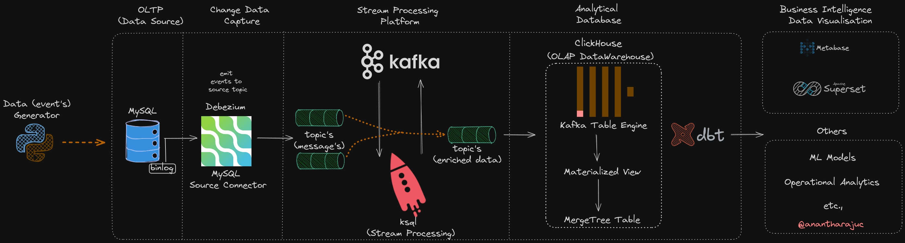

<!--
*** Thanks for checking out Streaming ETL pipeline MySQL. If you have a suggestion
*** that would make this better, please fork the repo and create a pull request
*** or simply open an issue with the tag "enhancement".
*** Thanks again!
-->
# Real-Time Streaming ETL Pipeline / Streaming Analytics: Real-Time Data Insights



In this project we will create a simple streaming data pipeline to continuously capture the changes in a MySQL database and replicate them in near real-time into ClickHouse. 

<div align="center">

[](CODE_OF_CONDUCT.md) [](https://twitter.com/intent/tweet?text=Checkout+this+recipe+for+streaming+ETL&url=https://github.com/AnanthaRajuC/Streaming_ETL_pipeline_MySQL&hashtags=DataEngineering) [](https://twitter.com/anantharajuc)
</div>

<div align="center">
  <sub>Built with ❤︎ by <a href="https://twitter.com/anantharajuc">Anantha Raju C</a> and <a href="https://github.com/AnanthaRajuC/Streaming_ETL_pipeline_MySQL/graphs/contributors">contributors</a>
</div>

</br>

<p align="center">
	<a href="https://github.com/AnanthaRajuC/Streaming_ETL_pipeline_MySQL/blob/master/README.md"><strong>Explore the docs »</strong></a>
	<br />
	<br />
	<a href="https://github.com/AnanthaRajuC/Streaming_ETL_pipeline_MySQL/issues">Report Bug</a>
	·
	<a href="https://github.com/AnanthaRajuC/Streaming_ETL_pipeline_MySQL/issues">Request Feature</a>
</p>

<!-- PROJECT SHIELDS -->
<!--
*** I'm using markdown "reference style" links for readability.
*** Reference links are enclosed in brackets [ ] instead of parentheses ( ).
-->

|     Service     | Badge | Badge | Badge | Badge | Badge |
|-----------------|-------|-------|-------|-------|-------|
|  **GitHub**     |[](https://github.com/AnanthaRajuC/Streaming_ETL_pipeline_MySQL/commits/master)|[](https://github.com/AnanthaRajuC/Streaming_ETL_pipeline_MySQL/pulls)|[](https://github.com/AnanthaRajuC/Streaming_ETL_pipeline_MySQL/issues)|[](https://github.com/AnanthaRajuC/Streaming_ETL_pipeline_MySQL/network)|[](https://github.com/AnanthaRajuC/Streaming_ETL_pipeline_MySQL/stargazers)|
|  **GitHub**     ||||||

## Details

- [Overview](documentation/OVERVIEW.MD)    
- [Technology stack](documentation/TECHNOLOGY_STACK.MD)    
- [Installation](documentation/INSTALLATION.MD)  
- [01 - Project Setup](documentation/PROJECT_SETUP.MD) 
- [02 - Initial MySQL Preparation](documentation/INITIAL_MYSQL_PREPARATION.MD)  
- [03 - Debezium CDC Configuration](documentation/DEBEZIUM_CDC_CONFIGURATION.MD) 
- [04 - ksqlDB Streams](documentation/KSQLDB_STREAMS.MD) 
- [ksqlDB Tables(Optional)](documentation/KSQLDB_TABLES.MD) 
- [05 - ClickHouse](documentation/ClickHouse.MD) 
- [06 - dbt (Optional)](documentation/DBT.MD) 
- 
- [Reference](documentation/REFERENCE.MD)  


## Reporting Issues/Suggest Improvements

This Project uses GitHub's integrated issue tracking system to record bugs and feature requests. If you want to raise an issue, please follow the recommendations below:

* 	Before you log a bug, please [search the issue tracker](https://github.com/AnanthaRajuC/Streaming_ETL_pipeline_MySQL/search?type=Issues) to see if someone has already reported the problem.
* 	If the issue doesn't already exist, [create a new issue](https://github.com/AnanthaRajuC/Streaming_ETL_pipeline_MySQL/issues/new)
* 	Please provide as much information as possible with the issue report.
* 	If you need to paste code, or include a stack trace use Markdown +++```+++ escapes before and after your text.

<!-- CONTRIBUTING -->
## Contributing

Contributions are what make the open source community such an amazing place to be learn, inspire, and create. Any contributions you make are **greatly appreciated**.

Kindly refer to [CONTRIBUTING.md](/CONTRIBUTING.md) for important **Pull Request Process** details

1. In the top-right corner of this page, click **Fork**.

2. Clone a copy of your fork on your local, replacing *YOUR-USERNAME* with your Github username.

   `git clone https://github.com/YOUR-USERNAME/Streaming_ETL_pipeline_MySQL.git`

3. **Create a branch**: 

   `git checkout -b <my-new-feature-or-fix>`

4. **Make necessary changes and commit those changes**:

   `git add .`

   `git commit -m "new feature or fix"`

5. **Push changes**, replacing `<add-your-branch-name>` with the name of the branch you created earlier at step #3. :

   `git push origin <add-your-branch-name>`

6. Submit your changes for review. Go to your repository on GitHub, you'll see a **Compare & pull request** button. Click on that button. Now submit the pull request.

That's it! Soon I'll be merging your changes into the master branch of this project. You will get a notification email once the changes have been merged. Thank you for your contribution.

Kindly follow [Conventional Commits](https://www.conventionalcommits.org/en/v1.0.0/) to create an explicit commit history. Kindly prefix the commit message with one of the following type's.

**build**   : Changes that affect the build system or external dependencies (example scopes: gulp, broccoli, npm)  
**ci**      : Changes to our CI configuration files and scripts (example scopes: Travis, Circle, BrowserStack, SauceLabs)  
**docs**    : Documentation only changes  
**feat**    : A new feature  
**fix**     : A bug fix  
**perf**    : A code change that improves performance  
**refactor**: A code change that neither fixes a bug nor adds a feature  
**style**   : Changes that do not affect the meaning of the code (white-space, formatting, missing semi-colons, etc)  
**test**    : Adding missing tests or correcting existing tests  

## License

Distributed under the MIT License. See [LICENSE.md](/LICENSE.md) for more information.

## The End

In the end, I hope you enjoyed the application and find it useful, as I did when I was developing it to learn about Streaming ETL pipeline/ infrastructures for real-time data processing and analytics. 

If you would like to enhance, please: 

* 	**Open PRs**, 
* 	Give **feedback**, 
* 	Add **new suggestions**, and
*	Finally, give it a 🌟.

* Happy Coding ...* 🙂

<!-- CONTACT -->
## Contact

Anantha Raju C - [@anantharajuc](https://twitter.com/anantharajuc) - arcswdev@gmail.com

Project Link: [https://github.com/AnanthaRajuC/Streaming_ETL_pipeline_MySQL](https://github.com/AnanthaRajuC/Streaming_ETL_pipeline_MySQL)
