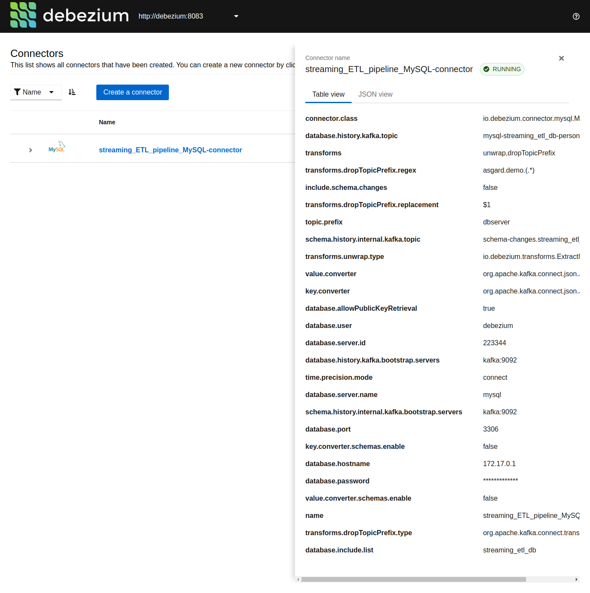
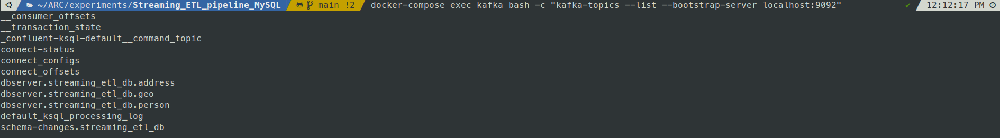
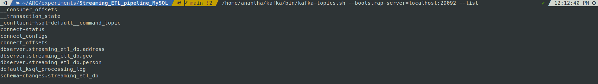
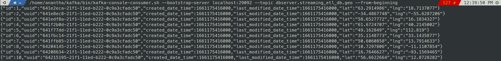
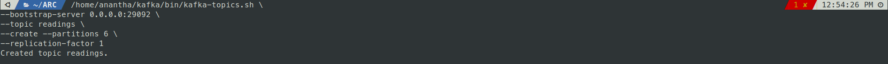
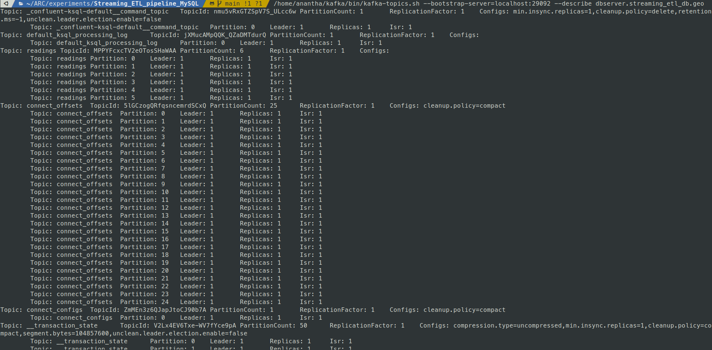
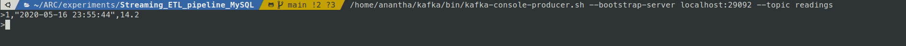

#### Debezium Registration

~~~shell
curl -i -X POST -H "Accept:application/json" -H "Content-Type:application/json" 127.0.0.1:8083/connectors/ -d @debeziumConfig.json
~~~

or

~~~shell
curl -i -X POST -H "Accept:application/json" -H "Content-Type:application/json" 127.0.0.1:8083/connectors/ -d '{
  "name": "streaming_ETL_pipeline_MySQL-connector",
  "config": {
    "connector.class": "io.debezium.connector.mysql.MySqlConnector",
    "database.hostname": "172.17.0.1",
    "database.port": "3306",
    "database.user": "debezium",
    "database.password": "Debezium@123#",
    "database.server.name": "mysql",
	  "database.server.id": "223344",
    "database.include.list": "streaming_etl_db",
	  "database.allowPublicKeyRetrieval": true,
	  "database.history.kafka.bootstrap.servers": "kafka:9092",
	  "database.history.kafka.topic": "mysql-streaming_etl_db-person",
    "include.schema.changes": false,
    "key.converter":"org.apache.kafka.connect.json.JsonConverter",
	  "key.converter.schemas.enable": "false",
	  "schema.history.internal.kafka.bootstrap.servers": "kafka:9092",
    "schema.history.internal.kafka.topic": "schema-changes.streaming_etl_db",
	  "time.precision.mode": "connect",
	  "topic.prefix": "dbserver",
    "transforms": "unwrap",
	  "transforms.unwrap.type": "io.debezium.transforms.ExtractNewRecordState",
	  "value.converter":"org.apache.kafka.connect.json.JsonConverter",
	  "value.converter.schemas.enable": "false"
  }
}'
~~~

#### Post Debezium registration.

[http://localhost:8083/connectors?expand=info&expand=status](http://localhost:8083/connectors?expand=info&expand=status)  

~~~json
{
  "streaming_ETL_pipeline_MySQL-connector": {
    "info": {
      "name": "streaming_ETL_pipeline_MySQL-connector",
      "config": {
        "connector.class": "io.debezium.connector.mysql.MySqlConnector",
        "database.allowPublicKeyRetrieval": "true",
        "database.user": "debezium",
        "database.server.id": "223344",
        "database.history.kafka.bootstrap.servers": "kafka:9092",
        "database.history.kafka.topic": "mysql-streaming_etl_db-person",
        "time.precision.mode": "connect",
        "transforms": "unwrap",
        "database.server.name": "mysql",
        "schema.history.internal.kafka.bootstrap.servers": "kafka:9092",
        "database.port": "3306",
        "include.schema.changes": "false",
        "key.converter.schemas.enable": "false",
        "topic.prefix": "dbserver",
        "schema.history.internal.kafka.topic": "schema-changes.streaming_etl_db",
        "database.hostname": "172.17.0.1",
        "database.password": "Debezium@123#",
        "value.converter.schemas.enable": "false",
        "name": "streaming_ETL_pipeline_MySQL-connector",
        "transforms.unwrap.type": "io.debezium.transforms.ExtractNewRecordState",
        "value.converter": "org.apache.kafka.connect.json.JsonConverter",
        "key.converter": "org.apache.kafka.connect.json.JsonConverter",
        "database.include.list": "streaming_etl_db"
      },
      "tasks": [
        {
          "connector": "streaming_ETL_pipeline_MySQL-connector",
          "task": 0
        }
      ],
      "type": "source"
    },
    "status": {
      "name": "streaming_ETL_pipeline_MySQL-connector",
      "connector": {
        "state": "RUNNING",
        "worker_id": "172.23.0.6:8083"
      },
      "tasks": [
        {
          "id": 0,
          "state": "RUNNING",
          "worker_id": "172.23.0.6:8083"
        }
      ],
      "type": "source"
    }
  }
}
~~~

[http://localhost:8083/connectors/streaming_ETL_pipeline_MySQL-connector/status](http://localhost:8083/connectors/streaming_ETL_pipeline_MySQL-connector/status) 

~~~json
{
  "name": "streaming_ETL_pipeline_MySQL-connector",
  "connector": {
    "state": "RUNNING",
    "worker_id": "172.23.0.6:8083"
  },
  "tasks": [
    {
      "id": 0,
      "state": "RUNNING",
      "worker_id": "172.23.0.6:8083"
    }
  ],
  "type": "source"
}
~~~

#### Debezium UI

[http://localhost:8080](http://localhost:8080) 

#### Kafka UI

[http://localhost:9099](http://localhost:9099)  

   

#### Person Topic

  

--- 

#### Client Connecting from the Same Docker Network

~~~shell
docker-compose exec kafka bash -c "kafka-topics --list --bootstrap-server localhost:9092"
~~~

 

#### Client Connecting from the Same Host

*update the path to kafka-topics.sh on your machine*

~~~shell
/home/anantha/kafka/bin/kafka-topics.sh --bootstrap-server=localhost:29092 --list
~~~

 

#### Display Kafka Topic Messages from the Same Host

~~~shell
/home/anantha/kafka/bin/kafka-console-consumer.sh --bootstrap-server localhost:29092 --topic dbserver.streaming_etl_db.geo --from-beginning
~~~

 

#### Create a from the Same Host

~~~shell
/home/anantha/kafka/bin/kafka-topics.sh \
--bootstrap-server 0.0.0.0:29092 \
--topic readings \
--create --partitions 6 \
--replication-factor 1
~~~

 

#### Describe Topic from the Same Host

~~~shell
/home/anantha/kafka/bin/kafka-topics.sh --bootstrap-server=localhost:29092 --describe dbserver.streaming_etl_db.geo
~~~

 

#### Post Message to Topic from the Same Host

~~~shell
/home/anantha/kafka/bin/kafka-console-producer.sh --bootstrap-server localhost:29092 --topic readings
~~~

 