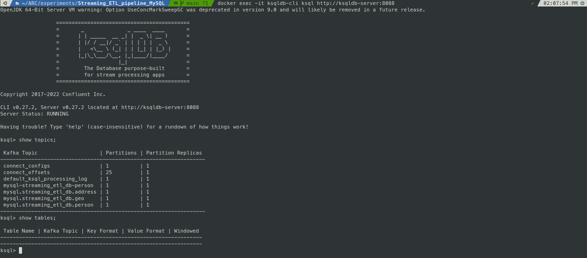

### ksqlDB Stream Processing

This section covers the ksqlDB layer of the pipeline. ksqlDB reads the Debezium change topics, joins `person`, `address` and `geo` into one enriched row per person, and writes the result to the `person_address_enriched` topic that ClickHouse consumes.

## Automated Setup

Every statement lives in [`ksqldb/pipeline.sql`](../ksqldb/pipeline.sql). The one-off `ksqldb-init` service in `docker-compose.yaml` runs it through `ksqldb/run-pipeline.sh` once ksqlDB is healthy and the Debezium connector is registered, then checks that the final join query is running. `deploy.sh` waits for it and stops with an error if it fails.

All statements use `IF NOT EXISTS`, so the script is safe to run again:

~~~shell
docker exec -it ksqldb-cli ksql http://ksqldb-server:8088 --file /dev/stdin < ksqldb/pipeline.sql
~~~

## Accessing ksqlDB via ksqldb-cli

~~~shell
docker exec -it ksqldb-cli ksql http://ksqldb-server:8088
~~~

Once connected, you can inspect the current state of topics, tables and queries:

~~~sql
show topics;
show tables;
show queries;
~~~

## Why Tables, Not Streams

Each Debezium topic is a changelog: every message is the latest state of one MySQL row, keyed by its primary key. ksqlDB reads each topic as a **TABLE**, so it always holds the current version of every row.

The joins between them are **foreign-key table-table joins**. Whenever any side changes, ksqlDB emits a new enriched row for every affected person:

| Change in MySQL                    | Result in `person_address_enriched`                  |
|------------------------------------|------------------------------------------------------|
| A person is inserted or updated    | That person is re-emitted                            |
| An address's city or state changes | Every person at that address is re-emitted           |
| A geo row's coordinates change     | Every person at an address using it is re-emitted    |
| A person is deleted                | That person is re-emitted with `IS_DELETED = 1`      |

An earlier version of this pipeline used a stream-stream join `WITHIN 1 HOURS`. That only matched a person to an address changed in the same hour, so most people had no city, and address changes never reached people who already existed.

### Kafka Message Format

`debeziumConfig.json` shapes the messages for ksqlDB:

- `ExtractNewRecordState` (`unwrap`) keeps only the row's new state.
- `delete.tombstone.handling.mode = rewrite` turns a delete into a normal message with `__deleted = "true"`, instead of a tombstone ksqlDB and ClickHouse would ignore.
- `ExtractField$Key` (`key`) makes the message key the bare `id` value, read with `KEY_FORMAT = 'JSON'`.

## Source Tables

~~~sql
SET 'auto.offset.reset' = 'earliest';

CREATE TABLE IF NOT EXISTS PERSON (
    ID BIGINT PRIMARY KEY,
    UUID VARCHAR,
    CREATED_DATE_TIME TIMESTAMP,
    LAST_MODIFIED_DATE_TIME TIMESTAMP,
    FIRST_NAME VARCHAR,
    LAST_NAME VARCHAR,
    EMAIL VARCHAR,
    GENDER VARCHAR,
    REGISTRATION TIMESTAMP,
    AGE INT,
    ADDRESS_ID BIGINT,
    `__deleted` VARCHAR
) WITH (
    KAFKA_TOPIC = 'dbserver.streaming_etl_db.person',
    KEY_FORMAT = 'JSON',
    VALUE_FORMAT = 'JSON',
    PARTITIONS = 1
);
~~~

`ADDRESS` and `GEO` are declared the same way over `dbserver.streaming_etl_db.address` and `dbserver.streaming_etl_db.geo`. See `ksqldb/pipeline.sql` for the full definitions.

~~~sql
SELECT * FROM PERSON EMIT CHANGES LIMIT 1;
DESCRIBE PERSON;
~~~

## Enrichment Joins

**Address with coordinates**, keyed by address ID:

~~~sql
CREATE TABLE IF NOT EXISTS ADDRESS_GEO WITH (
    KAFKA_TOPIC = 'address_geo', KEY_FORMAT = 'JSON', VALUE_FORMAT = 'JSON', PARTITIONS = 1
) AS
SELECT
    A.ID AS A_ID,
    A.CITY AS CITY,
    A.STATE AS STATE,
    A.ZIPCODE AS ZIPCODE,
    CAST(G.LAT AS DOUBLE) AS LAT,
    CAST(G.LNG AS DOUBLE) AS LNG
FROM ADDRESS A
LEFT JOIN GEO G ON A.GEO_ID = G.ID
EMIT CHANGES;
~~~

**Person with address and coordinates**, keyed by person ID:

~~~sql
CREATE TABLE IF NOT EXISTS PERSON_ADDRESS_ENRICHED WITH (
    KAFKA_TOPIC = 'person_address_enriched', KEY_FORMAT = 'JSON', VALUE_FORMAT = 'JSON', PARTITIONS = 1
) AS
SELECT
    P.ID AS PERSON_KEY,
    AS_VALUE(P.ID) AS P_ID,
    P.FIRST_NAME AS FIRST_NAME,
    P.LAST_NAME AS LAST_NAME,
    P.GENDER AS GENDER,
    P.AGE AS AGE,
    P.REGISTRATION AS REGISTRATION,
    P.ADDRESS_ID AS A_ID,
    AG.CITY AS CITY,
    AG.STATE AS STATE,
    AG.ZIPCODE AS ZIPCODE,
    AG.LAT AS LAT,
    AG.LNG AS LNG,
    P.LAST_MODIFIED_DATE_TIME AS UPDATED_AT,
    CASE WHEN P.`__deleted` = 'true' THEN 1 ELSE 0 END AS IS_DELETED
FROM PERSON P
LEFT JOIN ADDRESS_GEO AG ON P.ADDRESS_ID = AG.A_ID
EMIT CHANGES;
~~~

| Detail                  | Purpose                                                                          |
|-------------------------|----------------------------------------------------------------------------------|
| `LEFT JOIN ... ON P.ADDRESS_ID = AG.A_ID` | Foreign-key join: a person without an address is kept with a null `CITY` |
| `AS_VALUE(P.ID) AS P_ID`| Copies the key into the message value, which is all ClickHouse's Kafka engine reads |
| `IS_DELETED`            | `1` when the person was deleted in MySQL                                         |
| Timestamps              | Serialized as epoch milliseconds; ClickHouse converts them to `DateTime64(3)`   |

A person can be emitted more than once while the joins catch up (for example first with `CITY = null`, then with the city). ClickHouse keeps only the latest version; see [ClickHouse](ClickHouse.MD).

~~~sql
SELECT * FROM PERSON_ADDRESS_ENRICHED EMIT CHANGES LIMIT 5;
~~~
