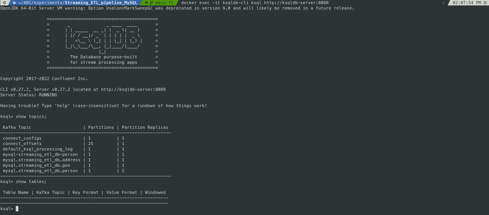

### Accessing ksqlDb via ksqldb-cli

This section covers the configuration and operation of ksqlDB for real-time stream processing within the streaming ETL pipeline. ksqlDB performs stream transformations, joins, and enrichment operations on data flowing from MySQL through Kafka topics before sending enriched data to ClickHouse for analytics.

## ksqlDB Role in the Pipeline

ksqlDB serves as the stream processing engine that transforms and enriches data in real-time. It consumes change events from Debezium-generated Kafka topics and produces enriched streams for downstream analytics systems.

~~~shell
docker exec -it ksqldb-cli ksql http://ksqldb-server:8088
~~~

### Basic ksqlDB Commands

Once connected to the ksqlDB CLI, you can inspect the current state of topics, streams, and tables:

~~~sql
show topics;
show streams;
show tables;
~~~

### Stream Creation and Configuration

ksqlDB streams are created to consume data from the Kafka topics generated by Debezium. The streams define the schema and processing configuration for the incoming change events.

**Stream Configuration Setup**

Before creating streams, configure the offset reset behavior:

~~~sql
SET 'auto.offset.reset' = 'earliest';
~~~

**Person Stream Definition**

~~~sql
CREATE STREAM PERSON_STREAM (
    id bigint,
    uuid VARCHAR,
    created_date_time TIMESTAMP,
    last_modified_date_time TIMESTAMP,
    first_name VARCHAR,
    last_name VARCHAR,
    email VARCHAR,
    gender VARCHAR,
    registration TIMESTAMP,
    age bigint,
    address_id bigint
) WITH (
    KAFKA_TOPIC='dbserver.streaming_etl_db.person',
    VALUE_FORMAT='JSON'
);
~~~

**Address Stream Definition**

~~~sql
CREATE STREAM ADDRESS_STREAM (
    id bigint,
    uuid VARCHAR,
    created_date_time TIMESTAMP,
    last_modified_date_time TIMESTAMP,
    city VARCHAR,
    zipcode VARCHAR,
    state VARCHAR,
    geo_id bigint
) WITH (
    KAFKA_TOPIC='dbserver.streaming_etl_db.address',
    VALUE_FORMAT='JSON'
);
~~~

~~~sql
SELECT * FROM PERSON_STREAM EMIT CHANGES LIMIT 1;

+---------------+---------------+---------------+---------------+---------------+---------------+---------------+---------------+---------------+---------------+---------------+
|ID             |UUID           |CREATED_DATE_TI|LAST_MODIFIED_D|FIRST_NAME     |LAST_NAME      |EMAIL          |GENDER         |REGISTRATION   |AGE            |ADDRESS_ID     |
|               |               |ME             |ATE_TIME       |               |               |               |               |               |               |               |
+---------------+---------------+---------------+---------------+---------------+---------------+---------------+---------------+---------------+---------------+---------------+
|1              |183cea86-96e9-4|2024-03-12T13:1|2024-03-12T13:1|Robert         |Burton         |rodneywhite@exa|Female         |2021-04-18T09:1|48             |61             |
|               |2e0-93f4-659f7c|2:32.000       |2:32.000       |               |               |mple.net       |               |0:06.000       |               |               |
|               |cd5e32         |               |               |               |               |               |               |               |               |               |
Limit Reached
Query terminated
~~~

~~~sql
DESCRIBE PERSON_STREAM;
~~~

~~~sql
select * from PERSON_STREAM LIMIT 5;
~~~

**Stream-Stream Join Implementation**

The primary processing operation is a stream-stream join that enriches person data with address information:

~~~sql
CREATE STREAM PERSON_ADDRESS_ENRICHED_STREAM 
WITH (
    FORMAT='JSON',
    KAFKA_TOPIC='person_address_enriched',
    PARTITIONS=1,
    REPLICAS=1
) AS 
SELECT
    P.ID P_ID,
    A.ID A_ID,
    P.FIRST_NAME FIRST_NAME,
    A.CITY CITY
FROM PERSON_STREAM P
LEFT OUTER JOIN ADDRESS_STREAM A 
    WITHIN 1 HOURS 
    GRACE PERIOD 30 MINUTES 
    ON ((A.ID = P.ADDRESS_ID))
EMIT CHANGES;
~~~

**Join Configuration Parameters**

| Parameter                 | Value             | Purpose                                                      |
|---------------------------|-------------------|--------------------------------------------------------------|
| `WITHIN 1 HOURS`          | 1 hour time window| Defines the temporal join window for stream correlation      |
| `GRACE PERIOD 30 MINUTES`| 30 minutes        | Allows late-arriving records to participate in joins         |
| `LEFT OUTER JOIN`         | Join type         | Ensures all person records are preserved even without matching addresses |
| `FORMAT='JSON'`           | Output format     | Specifies JSON serialization for the output stream           |

### Kafka Sink MySQL DB (IGNORE THIS SECTION)

~~~sql
CREATE SINK CONNECTOR SINK_PERSON_ADDRESS_ENRICHED_STREAM WITH (
    'connector.class'                     = 'io.confluent.connect.jdbc.JdbcSinkConnector',
    'connection.url'                      = 'jdbc:mysql://172.17.0.1:3306/',
    'connection.user'                     = 'debezium',
    'connection.password'                 = 'Debezium@123#',
    'topics'                              = 'PERSON_ADDRESS_ENRICHED_STREAM',
    'key.converter'						            = 'org.apache.kafka.connect.json.JsonConverter',	
	  'key.converter.schemas.enable'		    = 'false',
	  'value.converter'					            = 'org.apache.kafka.connect.json.JsonConverter',
	  'value.converter.schemas.enable'      = 'false'
);
~~~
