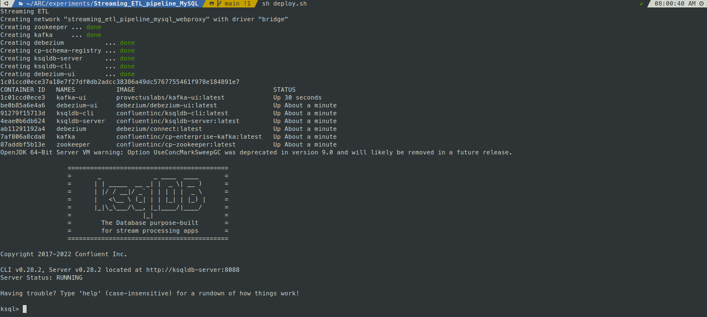
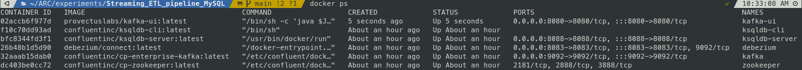
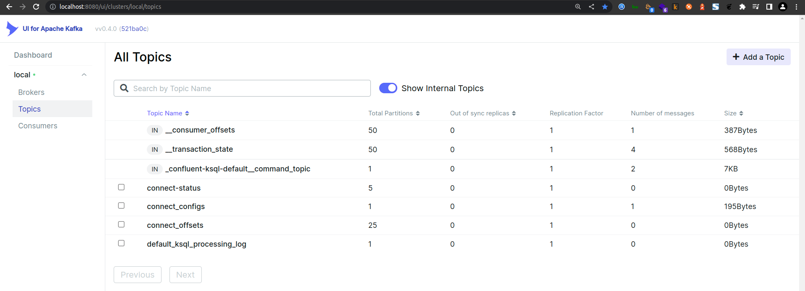
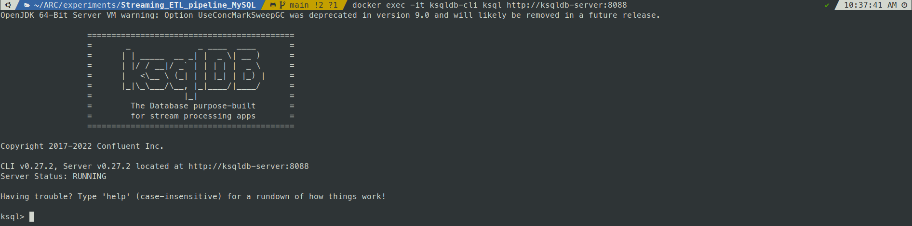
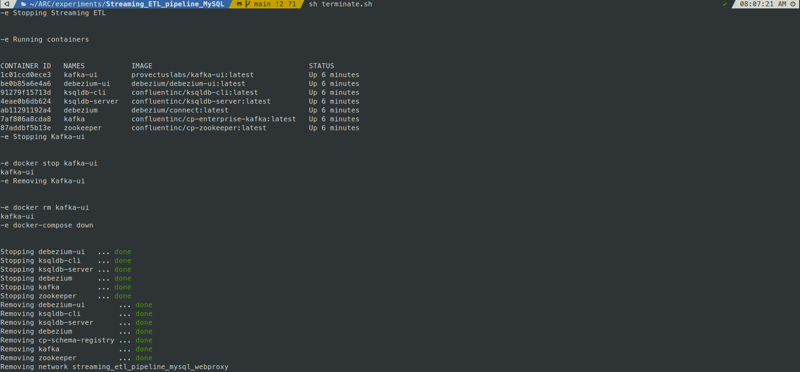

## Environment Deployment

This document covers the deployment of the containerized streaming ETL pipeline environment using Docker Compose orchestration and management scripts. It focuses on the automated and manual deployment processes, service verification, and environment teardown procedures.

## Deployment Architecture

The whole pipeline (MySQL, Kafka, Debezium, Schema Registry, ksqlDB, ClickHouse, Grafana and the Kafka and Debezium web UIs) is defined in `docker-compose.yaml`. Every image is pinned to a tested version, Kafka runs in KRaft mode (no ZooKeeper), and the services with healthchecks (MySQL, Kafka, Debezium Connect, ksqlDB, ClickHouse) gate the services that depend on them.

## Automated Deployment

The system provides the `deploy.sh` script for automated environment deployment with integrated service verification.

**Deploy Script Execution**

~~~bash
./deploy.sh
~~~

The automated deployment sequence performs the following operations:

| Step | Command                               | Purpose                                                   |
|------|---------------------------------------|-----------------------------------------------------------|
| 1    | `docker compose up -d --wait <services>` | Start every service except Grafana and wait until they report healthy |
| 2    | `docker compose wait ksqldb-init`     | Wait for the pipeline setup to finish; stop if it failed  |
| 3    | `docker compose up -d --wait grafana` | Start Grafana; if it fails, print a warning and carry on  |
| 4    | `docker compose ps -a`                | Display containers                                        |
| 5    | -                                     | Print the service URLs and commands to try the pipeline   |

`./deploy.sh` leaves the whole pipeline running, with no manual steps:

| Component  | Set up by                                     | What it creates                                                        |
|------------|-----------------------------------------------|------------------------------------------------------------------------|
| MySQL      | `mysql/init/*.sql`, `data/*.sql`              | `streaming_etl_db` schema, `debezium` CDC user, sample data            |
| Debezium   | `connector-init` service                      | The MySQL connector from `debeziumConfig.json`                         |
| ksqlDB     | `ksqldb-init` service                         | Tables and joins from `ksqldb/pipeline.sql`                            |
| ClickHouse | `clickhouse/init/00_database.sql`             | `KafkaEngine` database, Kafka engine table, materialized view, target table |
| Grafana    | `grafana/provisioning`, `grafana/dashboards`  | ClickHouse datasource and the live dashboard; see [Grafana](GRAFANA.MD) |

`connector-init` and `ksqldb-init` exit once they are done, so they show as `Exited (0)`.

--- 

## Manual Deployment Process

For granular control or troubleshooting, the deployment can be performed manually using individual Docker Compose commands.

**Pre-deployment Validation**

Validate the Docker Compose configuration before deployment:

~~~bash
docker compose -f docker-compose.yaml config
~~~

**Image Preparation**

Pull all required Docker images before starting services:

~~~bash
docker compose -f docker-compose.yaml pull
~~~

## Service Startup

Start the services using Docker Compose:

~~~shell
docker compose -f docker-compose.yaml up -d --wait
~~~

Expected output shows the creation of the `streaming_etl_webproxy` network and the containers becoming healthy:

~~~shell
 Network streaming_etl_webproxy  Created
 Container mysql                 Healthy
 Container kafka                 Healthy
 Container clickhouse            Healthy
 Container debezium              Healthy
 Container ksqldb-server         Healthy
 ...
~~~

## Service Verification

**Container Status Check**

Verify all containers are running:

`docker compose ps`

 

**Important**: All components must show **"Up"** status. If any container exited, check its logs with `docker compose logs <service>` and re-run `docker compose up -d --wait`.

URL to access Kafka-UI console: **http://localhost:9099**  

 

## ksqlDB CLI Access

Launch the ksqlDB CLI for stream processing operations:

~~~shell
docker exec -it ksqldb-cli ksql http://ksqldb-server:8088
~~~

 

## Service Access Points

| Service       | URL / Address            | Container        | Purpose                    |
|---------------|--------------------------|------------------|----------------------------|
| Grafana       | http://localhost:3000    | `grafana`        | Live dashboard (`admin` / `admin` to edit) |
| Debezium UI   | http://localhost:8080    | `debezium-ui`    | Connector management       |
| Kafka UI      | http://localhost:9099    | `kafka-ui`       | Topic monitoring           |
| Connect API   | http://localhost:8083    | `debezium`       | Debezium connector REST API|
| ksqlDB Server | http://localhost:8088    | `ksqldb-server`  | Stream processing API      |
| ClickHouse    | http://localhost:8123    | `clickhouse`     | Analytics database (`default` / `root`) |
| MySQL         | localhost:3306           | `mysql`          | Source database (`admin` / `password`)  |

--- 

## Environment Teardown

**Automated Teardown**

Use the `terminate.sh` script to stop and remove every container, the network and the containers' data volumes, so the next `./deploy.sh` starts from a clean slate:

~~~bash
./terminate.sh
~~~

**Manual Teardown Process**

~~~shell
docker compose -f docker-compose.yaml down -v
~~~

Without `-v`, the old MySQL and ClickHouse data volumes are left behind unused.

**State Preservation Option**

To preserve container state without removing containers, use:

~~~bash
docker compose stop
~~~

## Network and Port Configuration

**Docker Network**

The deployment creates a custom bridge network named `streaming_etl_webproxy` that enables inter-service communication using container hostnames (`mysql`, `kafka`, `debezium`, `ksqldb-server`, `clickhouse`, ...).

**Port Mapping Configuration**

| Service         | Internal Port | External Port | Protocol         |
|-----------------|---------------|---------------|------------------|
| mysql           | 3306          | 3306          | MySQL            |
| kafka           | 9092          | 9092          | PLAINTEXT (Docker network clients) |
| kafka           | 29092         | 29092         | PLAINTEXT_HOST (clients on the host, `localhost:29092`) |
| debezium        | 8083          | 8083          | HTTP             |
| schema-registry | 8081          | 8081          | HTTP             |
| ksqldb-server   | 8088          | 8088          | HTTP             |
| clickhouse      | 8123 / 9000   | 8123 / 9000   | HTTP / native    |
| debezium-ui     | 8080          | 8080          | HTTP             |
| kafka-ui        | 8080          | 9099          | HTTP             |
| grafana         | 3000          | 3000          | HTTP             |

## Environment Variable Configuration

Key environment variables for service configuration:

- **MySQL**: `database.env` (`MYSQL_ROOT_PASSWORD`, `MYSQL_USER`, `MYSQL_PASSWORD`), `MYSQL_DATABASE`
- **Kafka**: `KAFKA_PROCESS_ROLES`, `KAFKA_CONTROLLER_QUORUM_VOTERS`, `KAFKA_LISTENERS`, `KAFKA_ADVERTISED_LISTENERS`
- **Debezium**: `BOOTSTRAP_SERVERS`, `CONFIG_STORAGE_TOPIC`, `OFFSET_STORAGE_TOPIC`, `STATUS_STORAGE_TOPIC`
- **ksqlDB**: `KSQL_BOOTSTRAP_SERVERS`, `KSQL_LISTENERS`
- **Schema Registry**: `SCHEMA_REGISTRY_KAFKASTORE_BOOTSTRAP_SERVERS`
- **ClickHouse**: `CLICKHOUSE_USER`, `CLICKHOUSE_PASSWORD`
