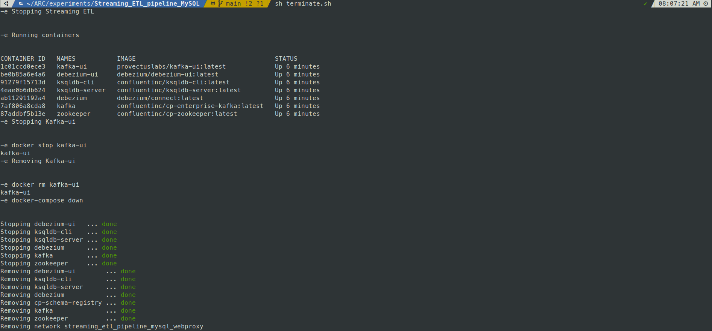

## Environment Deployment

This document covers the deployment of the containerized streaming ETL pipeline environment using Docker Compose orchestration and management scripts. It focuses on the automated and manual deployment processes, service verification, and environment teardown procedures.

## Deployment Architecture

The streaming ETL pipeline deploys as a coordinated set of containerized services managed through Docker Compose. The deployment creates a custom bridge network and orchestrates the startup sequence of dependent services.

## Automated Deployment

The system provides the `deploy.sh` script for automated environment deployment with integrated service verification.

**Deploy Script Execution**

~~~bash
sh deploy.sh
~~~

The automated deployment sequence performs the following operations:

| Step | Command                                      | Purpose                                 | Wait Time    |
|------|----------------------------------------------|-----------------------------------------|--------------|
| 1    | `docker-compose up -d`                       | Start core services in detached mode    | 30 seconds   |
| 2    | `docker run --name=kafka-ui ...`             | Deploy Kafka UI container               | 30 seconds   |
| 3    | `docker ps --format 'table ...'`             | Display running containers              | None         |
| 4    | `docker exec -it ksqldb-cli ksql ...`        | Launch interactive ksqlDB CLI           | None         |

We will use docker compose for a fast deployment of the demo. The shell script **deploy.sh** is designed to initialize the environment when triggered using **sh deploy.sh**. 

## Kafka UI Container Deployment

The `deploy.sh` script deploys Kafka UI as a separate container with specific network and environment configuration:

~~~bash
docker run --name=kafka-ui \
  --network=streaming_etl_pipeline_mysql_webproxy \
  -p 9099:8080 \
  -e KAFKA_CLUSTERS_0_NAME=local \
  -e KAFKA_CLUSTERS_0_BOOTSTRAPSERVERS=kafka:9092 \
  -d provectuslabs/kafka-ui:latest
~~~

--- 

## Manual Deployment Process

For granular control or troubleshooting, the deployment can be performed manually using individual Docker Compose commands.

**Pre-deployment Validation**

Validate the Docker Compose configuration before deployment:

~~~bash
docker compose -f docker-compose.yaml config
~~~

**Image Preparation**

Pull all required Docker images before starting services:

~~~bash
docker compose -f docker-compose.yaml pull
~~~

## Service Startup

Start the core services using Docker Compose:

~~~shell
docker compose -f docker-compose.yaml up
~~~

Expected output shows the creation of the `streaming_etl_pipeline_mysql_webproxy` network and sequential container startup:

~~~shell
Creating network "streaming_etl_pipeline_mysql_webproxy" with driver "bridge"
Creating zookeeper ... done
Creating kafka     ... done
Creating debezium           ... done
Creating cp-schema-registry ... done
Creating kafka-connect-01   ... done
Creating ksqldb-server      ... done
Creating ksqldb-cli         ... done
~~~

## Kafka UI Manual Deployment

Optionally, start [Kafka UI](https://github.com/provectus/kafka-ui), an open-source web UI for Apache Kafka Management

~~~shell
docker run --name=kafka-ui \
  --network=streaming_etl_pipeline_mysql_webproxy \
  -p 9099:8080 \
  -e KAFKA_CLUSTERS_0_NAME=local \
  -e KAFKA_CLUSTERS_0_BOOTSTRAPSERVERS=kafka:9092 \
  -d provectuslabs/kafka-ui:latest
~~~

## Service Verification

**Container Status Check**

Verify all containers are running with Up status:

`docker ps`

 

**Important**: All components must show **"Up"** status. If any containers show **"Exit"** status, re-issue the `docker-compose up -d` command.

URL to access Kakfka-UI console: **http://localhost:9099**  

 

## ksqlDB CLI Access

Launch the ksqlDB CLI for stream processing operations:

~~~shell
docker exec -it ksqldb-cli ksql http://ksqldb-server:8088
~~~

 

## Service Access Points

| Service       | URL                      | Container       | Purpose                   |
|---------------|--------------------------|------------------|----------------------------|
| Debezium UI   | http://localhost:8080    | `debezium-ui`    | Connector management       |
| Kafka UI      | http://localhost:9099    | `kafka-ui`       | Topic monitoring           |
| ksqlDB Server | http://localhost:8088    | `ksqldb-server`  | Stream processing API      |

--- 

## Environment Teardown

**Automated Teardown**

Use the `terminate.sh` script for complete environment cleanup:

~~~bash
sh terminate.sh
~~~

The teardown process includes diagnostic output and systematic container removal.

**Manual Teardown Process**

Alternatively, you may choose to follow the steps listed below, depending on your preference.

**1. Stop and remove Kafka UI container:**

~~~shell
docker stop kafka-ui

docker rm kafka-ui
~~~

**2. Stop and remove Docker Compose services:**

~~~shell
docker compose -f docker-compose.yaml down
~~~

Expected output shows systematic container and network removal:

~~~shell
Stopping ksqldb-cli       ... done
Stopping ksqldb-server    ... done
Stopping kafka-connect-01 ... done
Stopping debezium         ... done
Stopping kafka            ... done
Stopping zookeeper        ... done
Removing ksqldb-cli         ... done
Removing ksqldb-server      ... done
Removing kafka-connect-01   ... done
Removing cp-schema-registry ... done
Removing debezium           ... done
Removing kafka              ... done
Removing zookeeper          ... done
Removing network streaming_etl_pipeline_mysql_webproxy
~~~

**State Preservation Option**

To preserve container state without removing containers, use:

~~~bash
docker-compose stop
~~~

## Network and Port Configuration

**Docker Network**

The deployment creates a custom bridge network named `streaming_etl_pipeline_mysql_webproxy` that enables inter-service communication using container hostnames.

**Port Mapping Configuration**

| Service         | Internal Port | External Port | Protocol         |
|------------------|----------------|----------------|------------------|
| kafka            | 9092           | 9092           | PLAINTEXT        |
| kafka            | 9092           | 29092          | PLAINTEXT_HOST   |
| debezium         | 8083           | 8083           | HTTP             |
| schema-registry  | 8081           | 8081           | HTTP             |
| ksqldb-server    | 8088           | 8088           | HTTP             |
| debezium-ui      | 8080           | 8080           | HTTP             |
| kafka-ui         | 8080           | 9099           | HTTP             |

## Environment Variable Configuration

Key environment variables for service configuration:

- **Kafka**: `KAFKA_ADVERTISED_LISTENERS`, `KAFKA_ZOOKEEPER_CONNECT`
- **Debezium**: `BOOTSTRAP_SERVERS`, `CONFIG_STORAGE_TOPIC`, `OFFSET_STORAGE_TOPIC`
- **ksqlDB**: `KSQL_BOOTSTRAP_SERVERS`, `KSQL_LISTENERS`
- **Schema Registry**: `SCHEMA_REGISTRY_KAFKASTORE_CONNECTION_URL`
