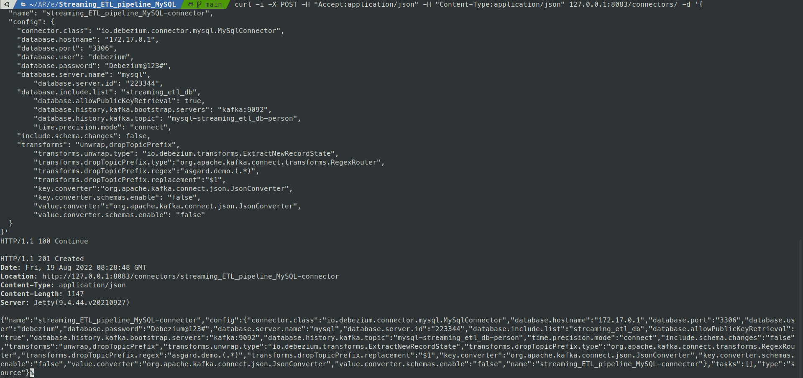
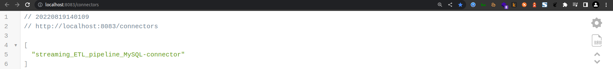
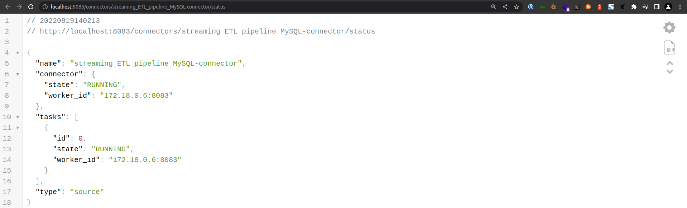

## Reference

This page provides a comprehensive reference of all command-line interfaces, REST API endpoints, and operational procedures for managing the Streaming ETL Pipeline. It covers Docker container operations, Kafka topic management, Debezium connector configuration, ksqlDB stream processing, and system monitoring commands.

Checkout additional Docker and DockerHub commands here, [https://github.com/AnanthaRajuC/Hacks-and-Code-Snippets/blob/master/Docker.md](https://github.com/AnanthaRajuC/Hacks-and-Code-Snippets/blob/master/Docker.md) 

## Docker Container Management

**Container Lifecycle Commands**

|                  Command          |                                             Description                                     |
|-----------------------------------|---------------------------------------------------------------------------------------------| 
|`docker-compose config`            | Check the build-file for syntax-errors	                                                  |
|`docker-compose up`                | Start the containers                                                                        |
|`docker-compose --compatibility up`| Start the containers using compatibility mode to set Memory and CPU Limits. Using --compatibility mode will attempt to convert that API v3 way of setting resource limits back into v2 compatible properties.                  |
|`docker-compose down`	            | Stop the containers, remove them from Docker and remove the connected networks from it.     |

|                  Command          |      Description                    |
|-----------------------------------|-------------------------------------| 
|`docker stop kafka-ui`             | Stop kafka-ui	                      |
|`docker rm kafka-ui`               | remove kafka-ui                     |

|                  Command                                                |       Description                                     |
|-------------------------------------------------------------------------|-------------------------------------------------------| 
|`docker ps --format 'table {{.ID}}\t{{.Names}}\t{{.Image}}\t{{.Status}}'`| list all the running containers                       |
|`docker rm -f $(docker ps -a -q)\n`                                      | remove containers                                     |       
|`docker system df`			                                              | Show storage usage                                    |
|`docker volume prune`	                                                  | remove all dangling volumes                           |
|`docker network ls`                                                      | List networks                                         |

|                           Command                                  |                                     Description                               |
|--------------------------------------------------------------------|-------------------------------------------------------------------------------| 
|`docker-machine ip default`							             | check your docker IP default, usually it is **192.168.99.102**			     |
|`docker images`                                                     | take a look at the container images.                                          |
|`docker ps`                                                         | list all the running containers.                                              |
|`docker ps -a`                                                      | list all the containers, including the ones that have finished executing.     |
|`docker restart [container_name]`							         | restart the docker image			                             		         |
|`docker stats`							                             | Show CPU and memory usage of all running containers                 	         |
|`docker stats [container_name]`						             | Show CPU and memory usage of a particular running container                   |
|`docker stats [container1_name] [container2_name]`			         | Show CPU and memory usage of container1, container2                           |
|`docker top [container_name]`			                             | Show running processes in a container                                         |
|`docker system df`			                                         | Show storage usage                                                            |
|`docker logs [container_id]`			                             | list container logs                                                           |
|`docker logs [container_id] --tail N`                               | list container logs, **`--tail`** flag will show the last **N** lines of logs |   
|`docker logs [container_id] --since YYYY-MM-DD`                     | list container logs since a particular date                                   |
|`docker logs [container_id] --since YYYY-MM-DDTHH:MM:SS.000000000Z` | list container logs since a particular timestamp                              |

## ksqlDB Stream Processing

##### Basic ksqlDb commands for reference

|                           Command                  |                                     Description                               |
|----------------------------------------------------|-------------------------------------------------------------------------------| 
|`show tables;`							             | list tables			                                                         |
|`show topics;`                                      | list topics                                                                   |

##### Configuring Debezium

~~~shell
curl -i -X POST -H "Accept:application/json" -H "Content-Type:application/json" 127.0.0.1:8083/connectors/ -d '{
  "name": "streaming_ETL_pipeline_MySQL-connector",
  "config": {
    "connector.class": "io.debezium.connector.mysql.MySqlConnector",
    "database.hostname": "172.17.0.1",
    "database.port": "3306",
    "database.user": "debezium",
    "database.password": "Debezium@123#",
    "database.server.name": "mysql",
	"database.server.id": "223344",
    "database.include.list": "streaming_etl_db",
	"database.allowPublicKeyRetrieval": true,
	"database.history.kafka.bootstrap.servers": "kafka:9092",
	"database.history.kafka.topic": "mysql-streaming_etl_db-person",
	"time.precision.mode": "connect",
    "include.schema.changes": false,
    "transforms": "unwrap,dropTopicPrefix",
	"transforms.unwrap.type": "io.debezium.transforms.ExtractNewRecordState",
	"transforms.dropTopicPrefix.type":"org.apache.kafka.connect.transforms.RegexRouter",
	"transforms.dropTopicPrefix.regex":"asgard.demo.(.*)",
	"transforms.dropTopicPrefix.replacement":"$1",
	"key.converter":"org.apache.kafka.connect.json.JsonConverter",
	"key.converter.schemas.enable": "false",
	"value.converter":"org.apache.kafka.connect.json.JsonConverter",
	"value.converter.schemas.enable": "false"
  }
}'
~~~

[http://localhost:8083/connectors](http://localhost:8083/connectors)  

[http://localhost:8083/connectors/streaming_ETL_pipeline_MySQL-connector/status](http://localhost:8083/connectors/streaming_ETL_pipeline_MySQL-connector/status)  

### MySQL Database Operations

**Binary Log Management**

~~~sql
SHOW BINARY LOGS;

PURGE BINARY LOGS TO 'mysql-bin.000005';
~~~

**Database Schema Inspection**

~~~sql
-- Check character set for specific column
SELECT 
	character_set_name 
FROM information_schema.`COLUMNS` 
WHERE table_schema = "streaming_etl_db"
AND table_name = "address"
AND column_name = "uuid";

-- Show full column information
SHOW FULL COLUMNS FROM streaming_etl_db.address; 

-- Check database charset and collation
SELECT 
	SCHEMA_NAME 'streaming_etl_db', 
	default_character_set_name 'charset', 
	DEFAULT_COLLATION_NAME 'collation' 
FROM information_schema.SCHEMATA;

-- Check for non-UTF8 collations
SELECT 
	DEFAULT_COLLATION_NAME 
FROM information_schema.SCHEMATA S 
WHERE schema_name = 'streaming_etl_db' 
AND DEFAULT_COLLATION_NAME != 'utf8_bin';
~~~

docker-compose exec kafka bash -c "kafka-topics --list --bootstrap-server localhost:9092"

__consumer_offsets
__transaction_state
_confluent-ksql-default__command_topic
connect-status
connect_configs
connect_offsets
dbserver.streaming_etl_db.address
dbserver.streaming_etl_db.geo
dbserver.streaming_etl_db.person
default_ksql_processing_log
schema-changes.streaming_etl_db

docker-compose exec kafka bash -c "kafka-topics --bootstrap-server localhost:9092 --describe dbserver.streaming_etl_db.geo"

/home/anantha/kafka/bin/kafka-topics.sh --bootstrap-server=localhost:29092 --list

- docker remove container based on status
docker rm $(docker ps --filter status=exited -q)

/home/anantha/kafka/bin/kafka-topics.sh --version

/home/anantha/kafka/bin/kafka-topics.sh \
--bootstrap-server 0.0.0.0:29092 \
--topic readings \
--create --partitions 6 \
--replication-factor 1

