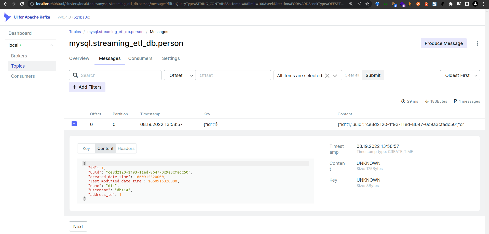

### MySQL

Refer to [Getting Started](/documentation/GETTING_STARTED.MD)

### Debezium Registration

~~~shell
curl -i -X POST -H "Accept:application/json" -H "Content-Type:application/json" 127.0.0.1:8083/connectors/ -d '{
  "name": "streaming_ETL_pipeline_MySQL-connector",
  "config": {
    "connector.class": "io.debezium.connector.mysql.MySqlConnector",
    "database.hostname": "172.17.0.1",
    "database.port": "3306",
    "database.user": "debezium",
    "database.password": "Debezium@123#",
    "database.server.name": "mysql",
	"database.server.id": "223344",
    "database.include.list": "streaming_etl_db",
	"database.allowPublicKeyRetrieval": true,
	"database.history.kafka.bootstrap.servers": "kafka:9092",
	"database.history.kafka.topic": "mysql-streaming_etl_db-person",
	"time.precision.mode": "connect",
    "include.schema.changes": false,
    "transforms": "unwrap,dropTopicPrefix",
	"transforms.unwrap.type": "io.debezium.transforms.ExtractNewRecordState",
	"transforms.dropTopicPrefix.type":"org.apache.kafka.connect.transforms.RegexRouter",
	"transforms.dropTopicPrefix.regex":"asgard.demo.(.*)",
	"transforms.dropTopicPrefix.replacement":"$1",
	"key.converter":"org.apache.kafka.connect.json.JsonConverter",
	"key.converter.schemas.enable": "false",
	"value.converter":"org.apache.kafka.connect.json.JsonConverter",
	"value.converter.schemas.enable": "false"
  }
}'
~~~

After Debezium registration.

[http://localhost:8083/connectors](http://localhost:8083/connectors)  

[http://localhost:8083/connectors/streaming_ETL_pipeline_MySQL-connector/status](http://localhost:8083/connectors/streaming_ETL_pipeline_MySQL-connector/status) 

Kafka UI

[http://localhost:8080](http://localhost:8080)  

   

Person Topic

  

### Accessing ksqlDb via ksqldb-cli

### ksqlDB

*   Check topics, streams and tables

~~~sql
ksql> show topics;

ksql> show streams;

ksql> show tables;
~~~

*	Declare Tables

~~~sql
ksql> CREATE TABLE PERSON (id bigint PRIMARY KEY,uuid VARCHAR,created_date_time TIMESTAMP,last_modified_date_time TIMESTAMP,name VARCHAR,username VARCHAR,address_id bigint) WITH (KAFKA_TOPIC='mysql.streaming_etl_db.person',VALUE_FORMAT='JSON');

ksql> CREATE TABLE ADDRESS (id bigint PRIMARY KEY,uuid VARCHAR,created_date_time TIMESTAMP,last_modified_date_time TIMESTAMP,city VARCHAR,street VARCHAR,suite VARCHAR,zipcode VARCHAR,geo_id bigint) WITH (KAFKA_TOPIC='mysql.streaming_etl_db.address',VALUE_FORMAT='JSON');
~~~

~~~sql
ksql> SELECT * FROM PERSON EMIT CHANGES LIMIT 1;

ksql> SELECT * FROM ADDRESS EMIT CHANGES LIMIT 1;
~~~

Joins

~~~sql
ksql> SELECT 
	P.NAME,
	A.CITY
FROM PERSON P
LEFT JOIN ADDRESS A on A.id = P.address_id
EMIT CHANGES 
LIMIT 1;
~~~

~~~sql
ksql> SELECT 
  P.NAME, 
  A.CITY
FROM PERSON P
INNER JOIN ADDRESS A
ON A.id = P.address_id
EMIT CHANGES
LIMIT 1;
~~~

~~~sql
ksql> CREATE TABLE PERSON_ADDRESS_ENRICHED (P_ID bigint,A_ID bigint,NAME VARCHAR,CITY VARCHAR) WITH (KAFKA_TOPIC='person_address_enriched',VALUE_FORMAT='JSON');
~~~

*	Declare Streams

~~~sql
ksql> CREATE STREAM PERSON_STREAM (id bigint,uuid VARCHAR,created_date_time TIMESTAMP,last_modified_date_time TIMESTAMP,name VARCHAR,username VARCHAR,address_id bigint) WITH (KAFKA_TOPIC='mysql.streaming_etl_db.person',VALUE_FORMAT='JSON');

ksql> CREATE STREAM ADDRESS_STREAM (id bigint,uuid VARCHAR,created_date_time TIMESTAMP,last_modified_date_time TIMESTAMP,city VARCHAR,street VARCHAR,suite VARCHAR,zipcode VARCHAR,geo_id bigint) WITH (KAFKA_TOPIC='mysql.streaming_etl_db.address',VALUE_FORMAT='JSON');
~~~

~~~sql
ksql> SELECT * FROM PERSON_STREAM EMIT CHANGES LIMIT 1;
+-------------------------+-------------------------+-------------------------+-------------------------+-------------------------+-------------------------+-------------------------+
|ID                       |UUID                     |CREATED_DATE_TIME        |LAST_MODIFIED_DATE_TIME  |NAME                     |USERNAME                 |ADDRESS_ID               |
+-------------------------+-------------------------+-------------------------+-------------------------+-------------------------+-------------------------+-------------------------+
|1                        |ce8d2120-1f93-11ed-8647-0|2022-08-19T13:22:00.000  |2022-08-19T13:22:00.000  |d14                      |dbz14                    |1                        |
|                         |c9a3cfadc50              |                         |                         |                         |                         |                         |
Limit Reached
Query terminated
~~~

~~~sql
DESCRIBE PERSON_STREAM;
select * from PERSON_STREAM;
~~~

*	stream-stream join

~~~sql
ksql> SET 'auto.offset.reset' = 'earliest';

ksql> CREATE STREAM PERSON_ADDRESS_ENRICHED_STREAM WITH (FORMAT='JSON', KAFKA_TOPIC='person_address_enriched', PARTITIONS=1, REPLICAS=1) AS 
SELECT
  P.ID P_ID,
  A.ID A_ID,
  P.NAME NAME,
  A.CITY CITY
FROM PERSON_STREAM P
LEFT OUTER JOIN ADDRESS_STREAM A WITHIN 1 HOURS GRACE PERIOD 30 MINUTES ON ((A.ID = P.ADDRESS_ID))
EMIT CHANGES;
~~~

*	Others

~~~sql
DROP TABLE IF EXISTS PERSON;
~~~

~~~sql
CREATE SINK CONNECTOR SINK_TXNS_ENRICHED_PG WITH (
    'connector.class'                     = 'io.confluent.connect.jdbc.JdbcSinkConnector',
    'connection.url'                      = 'jdbc:mysql://172.17.0.1:3306/',
    'connection.user'                     = 'debezium',
    'connection.password'                 = 'Debezium@123#',
    'topics'                              = 'PERSON_ADDRESS_ENRICHED_STREAM',
    'key.converter'						  ='org.apache.kafka.connect.json.JsonConverter',	
	'key.converter.schemas.enable'		  = 'false',
	'value.converter'					  ='org.apache.kafka.connect.json.JsonConverter',
	'value.converter.schemas.enable'      = 'false'
);
~~~

