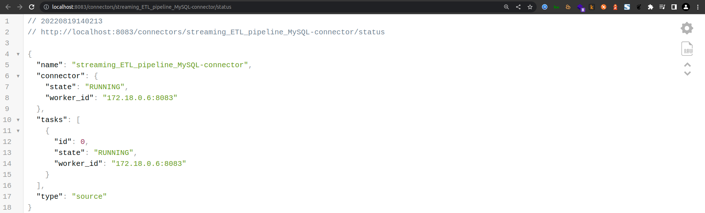
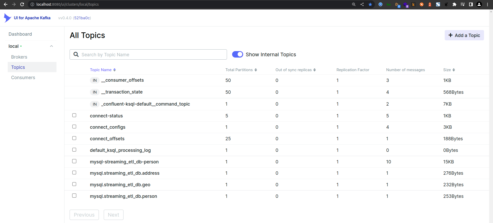

### Debezium Registration

~~~shell
curl -i -X POST -H "Accept:application/json" -H "Content-Type:application/json" 127.0.0.1:8083/connectors/ -d '{
  "name": "streaming_ETL_pipeline_MySQL-connector",
  "config": {
    "connector.class": "io.debezium.connector.mysql.MySqlConnector",
    "database.hostname": "172.17.0.1",
    "database.port": "3306",
    "database.user": "debezium",
    "database.password": "Debezium@123#",
    "database.server.name": "mysql",
	"database.server.id": "223344",
    "database.include.list": "streaming_etl_db",
	"database.allowPublicKeyRetrieval": true,
	"database.history.kafka.bootstrap.servers": "kafka:9092",
	"database.history.kafka.topic": "mysql-streaming_etl_db-person",
	"time.precision.mode": "connect",
    "include.schema.changes": false,
    "transforms": "unwrap,dropTopicPrefix",
	"transforms.unwrap.type": "io.debezium.transforms.ExtractNewRecordState",
	"transforms.dropTopicPrefix.type":"org.apache.kafka.connect.transforms.RegexRouter",
	"transforms.dropTopicPrefix.regex":"asgard.demo.(.*)",
	"transforms.dropTopicPrefix.replacement":"$1",
	"key.converter":"org.apache.kafka.connect.json.JsonConverter",
	"key.converter.schemas.enable": "false",
	"value.converter":"org.apache.kafka.connect.json.JsonConverter",
	"value.converter.schemas.enable": "false"
  }
}'
~~~

After Debezium registration.

[http://localhost:8083/connectors](http://localhost:8083/connectors)  

[http://localhost:8083/connectors/streaming_ETL_pipeline_MySQL-connector/status](http://localhost:8083/connectors/streaming_ETL_pipeline_MySQL-connector/status) 

   

Person Topic

  

### Accessing ksqlDb via ksqldb-cli

~~~shell
docker exec -it ksqldb-cli ksql http://ksqldb-server:8088
~~~

]
